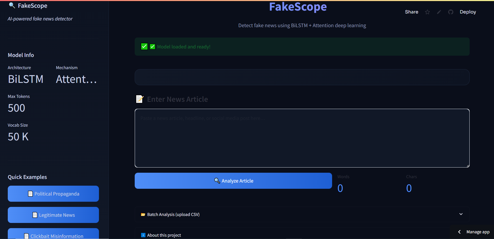
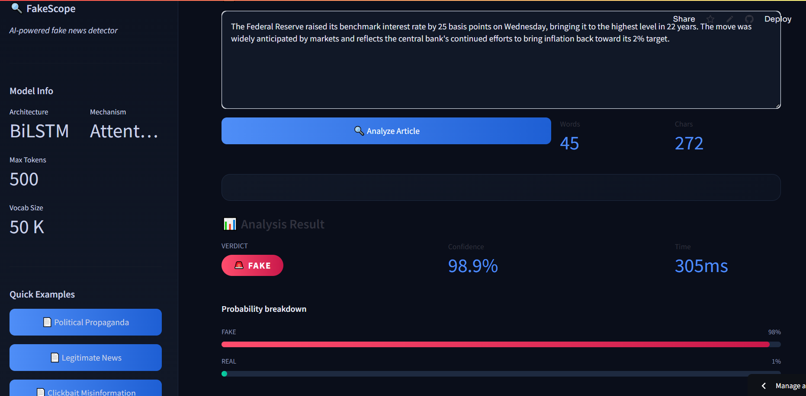

# 🔍 FakeScope — Fake News Detection using BiLSTM + Attention

[![Streamlit App]https://fake-news-detection-bilstm-attention-zz29kggtmsjh3rnr6qcr4n.streamlit.app/


A production-ready deep learning NLP system that classifies news articles as Fake or Real using a Bidirectional LSTM with custom Bahdanau Attention Mechanism. Trained on 44,000+ articles, achieving 97% accuracy, precision, recall, and F1-score. Deployed live on Streamlit Cloud with real-time inference under 310ms.

---
# Fake News Detection System
## Dataset
- Source: Kaggle Fake News Dataset
- Total articles: ~44,000 (Fake + Real combined)
- Split: 80% train / 20% test (stratified)
- Label: 0 = Real, 1 = Fake
 
## Dashboard



## Prediction Result



## 📌 Features

- **BiLSTM + Attention architecture** — captures long-range dependencies and attends to critical phrases
- **Full NLP preprocessing pipeline** — tokenization, stopword removal, lemmatization
- **Real-time single prediction** with confidence scores and probability breakdown
- **Batch CSV analysis** — upload and classify thousands of articles at once
- **Clean, dark-themed Streamlit UI** with interactive sidebar and example articles

---

## 🏗️ Model Architecture

```
Input → Embedding(50k vocab, 128-dim)
      → SpatialDropout(0.3)
      → BiLSTM(128 units, return_sequences=True)
      → BiLSTM(64 units, return_sequences=True)
      → AttentionLayer (Bahdanau soft attention)
      → Dense(128, ReLU) → Dropout(0.3)
      → Dense(64,  ReLU) → Dropout(0.15)
      → Dense(1, Sigmoid)   # 0 = Real, 1 = Fake
```

**Loss:** Binary Cross-Entropy  
**Optimizer:** Adam with ReduceLROnPlateau  
**Callbacks:** EarlyStopping · ModelCheckpoint · ReduceLROnPlateau

---

## 🚀 Getting Started

### 1. Clone the repo
```bash
git clone https://github.com/YOUR_USERNAME/fake-news-detection-bilstm-attention.git
cd fake-news-detection-bilstm-attention
```

### 2. Install dependencies
```bash
pip install -r requirements.txt
```

### 3. Prepare data
Place your labelled CSV at `data/news.csv` with columns:

| Column | Values |
|--------|--------|
| `text`  | Article body (string) |
| `title` | Headline (optional)  |
| `label` | `fake` / `real` or `1` / `0` |

> Recommended datasets: [WELFake](https://zenodo.org/record/4561253), [LIAR](https://www.cs.ucsb.edu/~william/data/liar_dataset.zip), [Kaggle Fake News](https://www.kaggle.com/c/fake-news/data)

### 4. Train the model
```bash
python train.py
# Or with custom args:
python train.py --data data/news.csv --epochs 15 --batch 32
```

### 5. Run the app

# Fake News Detection Using BiLSTM and Attention

A deep learning NLP project that classifies news articles as Fake or Real using BiLSTM and Attention Mechanism.

## Technologies Used
- Python
- TensorFlow
- Keras
- NLP
- Streamlit
- Scikit-learn

## Run Application


```bash
streamlit run app.py
```

---

## 📁 Project Structure

```
fake-news-detection-bilstm-attention/
├── app.py              # Streamlit web application
├── predict.py          # Inference module (used by app.py)
├── train.py            # Model training script
├── requirements.txt    # Python dependencies
├── runtime.txt         # Python version for Streamlit Cloud
├── data/               # (Place your dataset here)
├── models/             # Saved model + tokenizer (after training)
│   ├── bilstm_attention_model.h5
│   └── tokenizer.pkl
└── notebooks/          # EDA and experimentation notebooks
```

---

## ☁️ Deploying to Streamlit Community Cloud

1. Push trained model files (`models/*.h5`, `models/*.pkl`) to GitHub
2. Go to [share.streamlit.io](https://share.streamlit.io)
3. Connect your GitHub repo
4. Set **Main file path** to `app.py`
5. Click **Deploy** — done!

> **Note:** Model files must be in the repo for deployment. If they exceed GitHub's 100MB limit, use [Git LFS](https://git-lfs.com/).

---

## 📊 Results

| Metric    | Score |
|-----------|-------|
| Accuracy  | 97%   |
| Precision | 97%   |
| Recall    | 97%   |
| F1-Score  | 97%   |
| Inference | <310ms|
| Vocab Size| 50,000 tokens |
| Train Size| ~35,000 articles |

*(Results depend on dataset used for training)*

---

## 🛠️ Tech Stack

- **TensorFlow / Keras** — model training & inference
- **NLTK** — text preprocessing
- **Scikit-learn** — evaluation metrics
- **Streamlit** — web application
- **Pandas / NumPy** — data manipulation

---

